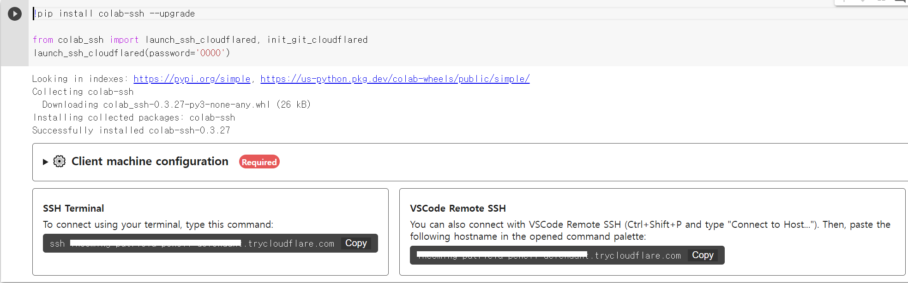

## 1. vscode에서 "Remote ssh extension" 설치
<br/>

- - -
## 2. 로컬 환경의 "Cloudflared connections" 설치
[DOWNLOAD LINK](https://developers.cloudflare.com/cloudflare-one/connections/connect-apps/install-and-setup/installation)   
*아래로 조금 내려가면 Windows가 있고 64, 32bit중 컴퓨터에 맞는 환경 설치하면 됨*   
<br/>

- - -
## 3. Remote config 설정   
> 1. Ctrl + Shift + P 로 명령 팔레트로 이동
> 2. Remote-SSH: Open SSH Configuration file... 검색하고 선택
> 3. C:\Users\{사용자이름}\.ssh\config 선택
> 4. 아래의 설정 입력
```
Host *.trycloudflare.com
    HostName %h
    User roo택
    Port 22
    ProxyCommand {CloudlflaredPath}/{CloudflaredFile} access ssh --hostname %h
```
*{CloudflaredPath}는 2번에서 설치한 Cloudflared 파일이 저장되어 있는 경로*   
*{CloudflaredFile}은 2번에서 설치한 Cloudflared 파일의 이름(.exe확장자 포함)*   
<br/>

- - - 
## 4. colab의 코드셀 추가하고 아래 코드 입력하고 실행
```
!pip install colab-ssh --upgrade

from colab_ssh import launch_ssh_cloudflared, init_git_cloudflared
launch_ssh_cloudflared(password='PASSWORD')
```
! 추후에 패스워드 입력해야 되기 때문에 패스워드 임의로 정해서 기억해놓아야 함   
실행완료하면 아래의 창이 나오는데 오른쪽 아래 VSCode Remote SSH 부분 링크 Copy     
</img>   

<br/>

- - - 
## 5. remote ssh 실행
> 1. Ctrl + Shift + P 로 명령 팔레트로 이동
> 2. Remote-SSH: Connect to Host 검색하고 선택
> 3. Add New SSH Host... 선택
> 4. 4번 과정에서 복사한 키 입력후 엔터
> 5. Config에 적용
> 6. 새로운 VSCode창이 실행

<br/>

- - -
## 6. 새로운 Vscode창에서의 조작
- Linux, Windows, MacOS 중 선택
- OpenFolder 하면 패스워드 입력 (코드에서 정한 패스워드 입력)
- /Content/Drive/MyDrive/ 에 저장하면 자동으로 드라이브랑 연동됨

<br/>

- - -
## 프로그램을 다시실행하거나 런타임 연결이 끊기고 다시 시작하여야 한다면 4번과정부터 6번과정까지 다시 실행하여야 한다.    
<br/>

- - -
## 추가: 구글드라이브로 코랩에 파일 임포트
```
import os, sys
GDRIVE_HOME = 'content/drive/MyDrive'
research_root = os.path.join(GDRIVE_HOME, 'research')
sys.path.append(research_root)
```

<br/><br/>

# 로컬 컴퓨터 환경에서 노트북 예제 사용하기

## 설치할 외부 패키지 설치

아래의 외부 패키지들은 아래와 같은 명령어를 Terminal 창에서 입력하여 패키지를 설치한다.

```pip install {패키지 이름}```

패키지를 설치하게 되면 패키지를 import하고 사용할 수 있다.

.ipynb 확장자로 파일을 생성하면 colab과 같이 노트북을 사용할 수 있다.   
코드셀 실행시 kernal을 base(또는 현재 환경에 설정되어 있는 파이썬)로 설정하여 코드셀을 실행하면 된다.

<br/>

### 설치할 패키지
```pandas``` : 데이터 처리와 분석을 위해 시리즈, 데이터프레임을 구성하고 다루기 위한 패키지

```matplotlib``` : numpy 라이브러리를 활용한 데이터 시각화 패키지

```beautifulsoup4``` : HTML과 XML 문서들의 구문을 분석하기 위한 패키지

### 기타 패키지
```numpy``` : 고성능의 수치 계산을 할 수 있는 수학, 과학 연산을 위한 라이브러리 (pandas 또는 matplotlib을 설치하면 자동으로 설치됨)

```gdown``` : 구글 드라이브에서 파일을 가져올 수 있게 하는 패키지 (구글 드라이브를 이용하여 파일을 사용할 경우 선택사항)
